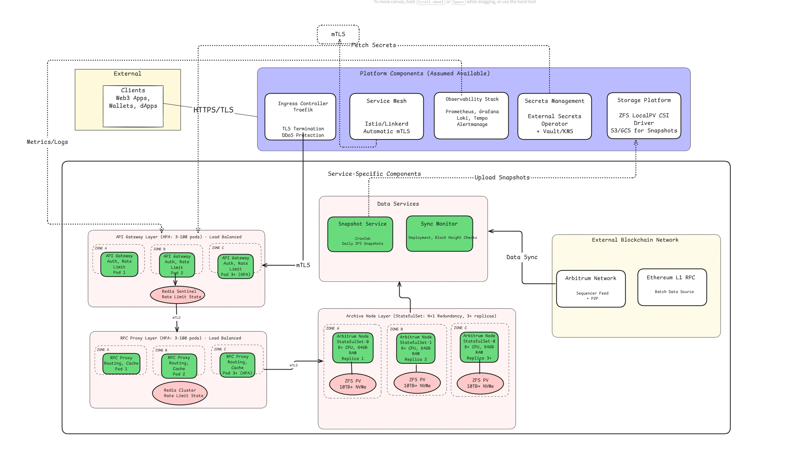

  # Overview

This document outlines the production-readiness requirements for high Quality of Service Arbitrum RPC service. This system is designed to serve external, paying customers with high expectations for availability, performance, and security. All requirements listed herein are recommended for production launch.

# High Level Architecture




## Production Requirements Checklist
## 1. Availability & Disaster Recovery

This pillar defines the service's uptime and resilience targets.
1.1. Service Level Objectives (SLOs):
- Availability: >= 99.95% (monthly).
- Recovery Time Objective (RTO): <= 3 minutes for full service restoration after a regional failure.

1.2. Architecture Requirements:
- Redundancy: N+2 redundancy for all stateless components (minimum 3 replicas).
- Distribution: Must be deployed across >= 3 Availability Zones (AZs).
- Topology: Use pod anti-affinity to prevent replicas from colocating on the same node or in the same zone.

1.3 Failure & Deployment:
- Automated Failover: <= 30s detection and traffic reroute on pod or node failure.
- Self-Healing: Automated pod restarts on liveness probe failures.
- Zero-Downtime Deployments: Use rolling updates with readiness probe validation to ensure no impact.
- Graceful Shutdown: Handle SIGTERM to allow for connection draining and in-flight request completion (30s+ grace period, 300s for archive nodes).

## 2. Performance & Scalability
This defines the service's load and latency targets.

2.1 SLOs:
- Throughput (Base): >= 100,000 RPS.
- Throughput (Traffic Spike): Must handle 5x traffic spikes (500,000 RPS) for at least 10 minutes without service degradation.
- Latency (Standard RPC):
	- P50: <= 100ms
	- P95: <= 300ms
	- P99: <= 500ms
- Latency (Archive Queries): P95 <= 2s for historical state queries.

2.2 Design Requirements:
- **Autoscaling:**
    - **Stateless Services (RPC Proxy):**
        - Horizontal Pod Autoscaler (HPA) based on CPU (target 70%), memory (target 80%), and custom metrics (request queue depth)
        - Min replicas: 3 (maintain N+2 redundancy)
        - Max replicas: 100 (sufficient for 500k RPS spike at ~5k RPS per pod)
        - Scale-up: Add pods when metrics exceed target for 30s
        - Scale-down: Remove pods after 5 minutes below target (prevent flapping)
    - **Stateful Services (Archive Nodes):**
        - Cannot autoscale automatically due to sync requirements
        - Must maintain >= 30% capacity headroom above peak observed load
        - Scaling procedure:
            - Provision new StatefulSet replica
            - Initialize PVC from latest ZFS snapshot via CSI VolumeSnapshot restore
            - Monitor sync progress until block lag < 5 blocks
            - Add to load balancer rotation via readiness probe passing
        - Target bootstrap time: < 2 hours from snapshot to production-ready
        - Scaling triggers: CPU > 70%, memory > 80%, query latency P95 degradation, or capacity planning projections
        - Vertical scaling not supported (requires pod recreation with data migration)
- **Caching:** Use a distributed cache like Redis for high-frequency, immutable data (e.g., block data, transaction receipts).
- **Connection Pooling:** Efficiently reuse persistent connections to backend archive nodes.

2.3. Request Routing & Connection Management:
- **Intelligent Routing:** RPC gateway must route requests based on method type:
    - Read-only calls (eth_call, eth_getBalance, eth_getBlockByNumber) load-balanced across all healthy archive nodes
    - Write calls (eth_sendRawTransaction) broadcast to multiple nodes or routed to dedicated subset for propagation
    - Archive queries (historical eth_getLogs) routed to nodes with full historical data
- **Sticky Sessions:** Support session affinity for stateful operations (eth_newFilter, eth_subscribe) to maintain filter state
- **Connection Draining:** Load balancers must support connection draining during pod termination to prevent dropped requests

## 3. System Architecture & Data Management
This section defines the specification for stateful components (archive nodes) and data persistence.

3.1 Node & Storage Specifications:
- Archive Node Compute: >= 8 CPU cores, >= 64GB RAM per node.
- Storage Capacity: 10TB+ initial capacity, with automated alerting when utilization exceeds 80%.
- Archive Node Storage: Local, high-performance NVMe storage with sustained low latency (< 1ms p99).

3.2. Kubernetes Storage Configuration:
- Provisioner: Use a performance-oriented provisioner (ZFS LocalPV as assumed).
- Storage Class: Configured for high IOPS and features like compression and snapshotting.
- Volume Binding: WaitForFirstConsumer to ensure pod-to-storage locality.
- Reclaim Policy: Retain to prevent accidental data loss on PVC deletion.

3.3. Data Integrity & Recovery:
- **Backup Strategy:**
    - Daily ZFS snapshots automated via CSI VolumeSnapshot
    - Snapshots copied to off-site object storage (S3/GCS)
    - Snapshots must be taken from healthy, fully-synced nodes only
- **Backup Retention:** Configurable retention, minimum 7 days, recommended 30 days.
- **Node Bootstrap:**
    - New archive nodes must be initialized from recent snapshots using CSI VolumeSnapshot restore
    - Target bootstrap time: < 2 hours from snapshot to fully synced node
    - Process: Provision PVC from snapshot, start node, sync remaining blocks
- **Sync Monitoring:**
    - Warning: Block lag > 5 blocks
    - Critical: Block lag > 20 blocks
    - Remove from load balancer: Block lag > 50 blocks

## 4. Observability & Health
This section defines the requirement for monitoring, logging, tracing, and health checking.

4.1. Health Probes: 
- Liveness: Detect and restart failed/stuck containers.
- Readiness: Gate traffic, probes must verify both service health and data freshness (block sync status within acceptable lag).
- Startup: Should be tuned to handle slow-starting archive nodes (e.g., 5-10 minutes initial startup).

4.2. Metrics (Prometheus):
- RPC Service: Request count (by method, status code, customer), request latency (P50, P95, P99), error rate (%), per-customer rate limit hits, requests per tier.
- Blockchain Node: Block height, sync lag, peer count.
- Cache: Hit rate, miss rate, eviction count.
- Queues: Request queue depth, processing time.

4.3. Logging (Loki):
- Format: Structured JSON logs for all services.
- Traceability: A unique request ID must be generated at ingress and propagated through all logs and service calls.
- Context: Error logs must include detailed context (e.g., request parameters, stack traces).
- Audit: Log all authentication, authorization, and API key management events.

4.4. Tracing (Tempo):
- End-to-End: Sampled traces covering the full request path: Ingress -> API Gateway -> RPC Proxy -> Archive Node.
- Profiling: Traces must identify performance bottlenecks in the call chain.

4.5. Alerting (Alertmanager):
- SLO-Based: Alert on latency P95/P99 breaches and error rates > 1%.
	Node Health:
	- Warning: Sync lag > 5 blocks
	- Critical: Sync lag > 20 blocks
	- Alert on high peer churn (peer count drops > 30%)
Resource: Alert on high CPU/memory/storage utilization (> 80%) and HPA saturation.
Cache: Alert on low cache hit rate (< 90%).

## 5. Security & Access Control
This section defines the security requirements for the service, following a Zero-Trust model.

5.1. Network Security:

- Ingress: All external traffic over HTTPS (TLS). DDoS protection and global rate limiting must be enabled.
- Internal: A service mesh Istio must be used to enforce mTLS (mutual TLS) for all pod-to-pod communication.
- Policies: Strict NetworkPolicies must be in place to restrict communication to only what is necessary (default-deny).

5.2. Authentication & Authorization:

- API Keys: Secure system for API key generation, rotation, and revocation.
- Per-Customer Rate Limiting: System must support configurable rate limits per customer/API key.
- JWT Validation: Securely validate JWTs for any authenticated management endpoints.

5.3. Secrets & Workload Identity:

- Secrets Management: No secrets in code or ConfigMaps. All secrets (API keys, credentials) must be injected from an external system (e.g., Vault, cloud KMS).
- Credential Rotation: Support for automated, zero-downtime rotation of all internal credentials.
- Pod Security:
	- Containers must run as non-root user
	- Root filesystem must be read-only
	- Drop all unnecessary Linux capabilities (securityContext.capabilities.drop: ["ALL"])
	- No privileged containers
	- AppArmor/SELinux profiles enabled where available

5.4. RPC-Specific Security Controls:
- Query Limits:
	- eth_getLogs: Max 10,000 block range per query
	- eth_call: Gas limit enforcement to prevent execution DoS
	- Timeout limits: 30s for standard queries, 120s for archive queries
	- Block excessively large payloads (> 1MB request size)

- Method Access Control by Tier:
	- Free tier: Standard eth_* methods only (eth_call, eth_getBalance, eth_sendRawTransaction)
	- Pro tier: Add eth_getLogs with block range limits
	- Enterprise tier: Full access including debug_, trace_, arbtrace_* methods

- Request Validation:
	- Reject malformed JSON-RPC requests
	- Validate block number ranges and parameters
	- Rate limit by compute cost, not just request count


## 6. Deployment & Lifecycle

This section defines the CI/CD and change management processes.

6.1. Methodology:

- GitOps: All cluster and application configuration must be managed via a GitOps workflow (e.g., ArgoCD, Flux) as the single source of truth.
- Configuration: All application settings must be externalized via ConfigMaps or external providers.
- Versioning: All container images and dependency charts must use pinned versions.

6.2. Deployment & Rollback:
- **Strategy:**
    - Stateless components (RPC Proxy, Gateway): Rolling updates with PodDisruptionBudget (minAvailable: N-1) to ensure availability
    - Stateful components (Archive Nodes): OnDelete or partitioned RollingUpdate strategy
        - Manual progressive rollout: Update one replica, verify sync and health, then proceed to next
        - Never perform simultaneous updates of all archive nodes
    - Support for Canary deployments (route small % of traffic to new version before full rollout)
    - Support for Blue-Green deployments for major version changes
- **Automation:** Deployment pipeline must automatically roll back on critical SLO violations (e.g., error rate > 5%, latency P95 breach)
- **PodDisruptionBudget:** Must be configured for all components to prevent excessive pod evictions during cluster maintenance

6.3. Testing & Validation:

- CI Pipeline: Must include unit tests, integration tests, and static security analysis (SAST) on every commit.
- Pre-Production: A staging environment must be used to run:
    - Load Tests: Regular tests simulating 2x peak capacity (200,000 RPS).
    - Chaos Tests: Automated failure injection (e.g., kill pods, drop network, spike latency) to validate resilience.
    - Arbitrum-Specific Tests:
        - Archive query performance across full chain history
        - WebSocket connection stability (long-running connections)
        - Block reorganization handling


## 7. Capacity & Cost Management

This section defines the requirements for resource planning and financial tracking.

7.1. Capacity Planning:

- Headroom: Must maintain >= 30% resource headroom (CPU, memory, IOPS, network) above observed peak load.
- Projections: Maintain models for 3x traffic growth and 1TB/month storage growth, reviewed quarterly.
- Load Testing: Regular load tests (see 7.3) to validate capacity and identify bottlenecks.


## Kubernetes Translation

This section maps the architecture components to specific Kubernetes resources, highlighting key configurations that fulfill the production requirements.

### 1. Storage (`StorageClass`)

This `StorageClass` leverages OpenEBS ZFS LocalPV CSI driver on dedicated high-I/O worker nodes with NVMe storage.

- **Prerequisites:**
    - ZFS pools must be pre-created on worker nodes from NVMe devices (e.g., `zpool create nvme-pool /dev/nvme0n1`)
    - Worker nodes must be labeled: `node-type=arbitrum-archive-io` and `openebs.io/zfs-node=true`
    - OpenEBS ZFS CSI driver must be installed in the cluster
- **Key Configuration:**
    - `volumeBindingMode: WaitForFirstConsumer` -  Delays PVC binding until pod is scheduled. Ensures pod and storage co-locate on the same physical node for maximum I/O performance. Without this, scheduler might place pod on one node while storage is created on another, breaking local storage.
    - `poolname: "nvme-pool"` - Name of ZFS pool created on each worker node. Must match actual pool name on nodes.
    - `reclaimPolicy: Retain` - Prevents accidental data loss if PVC is deleted. With 10TB+ archive data that takes weeks to sync, volumes must survive PVC deletion.
    - `allowedTopologies` - Constrains volume creation to only nodes with ZFS pools across 3 availability zones.
    - ZFS parameters (`compression: lz4`, `recordsize: 128k`) - Optimizes for blockchain workload: compression saves 30-50% space, large recordsize suits sequential I/O patterns.

    Note: `lz4` stands out for its balance between speed and compression ratio. LZ4 is particularly effective for large files and data streams, offering a good trade-off between compression speed and the compression ratio. 


```yaml
apiVersion: storage.k8s.io/v1
kind: StorageClass
metadata:
  name: arbitrum-local-nvme
provisioner: zfs.csi.openebs.io
parameters:
  # Name of ZFS pool pre-created on worker nodes
  poolname: "nvme-pool"
  
  # ZFS dataset properties
  fstype: "zfs"
  compression: "lz4"        # Fast compression, saves 30-50% space
  dedup: "off"              # Dedup too CPU-intensive for high-throughput
  recordsize: "128k"        # Optimized for large sequential I/O
  shared: "no"              # Local storage, not shared

# CWait for pod scheduling before binding volume
volumeBindingMode: WaitForFirstConsumer

# Allow volume expansion (requires ZFS quota support)
allowVolumeExpansion: true

# Retain volumes even if PVC deleted
reclaimPolicy: Retain

# Topology: only nodes with ZFS pools in these zones
allowedTopologies:
- matchLabelExpressions:
  - key: topology.kubernetes.io/zone
    values:
    - us-east-1a
    - us-east-1b
    - us-east-1c
  - key: openebs.io/zfs-node
    values:
    - "true"
```

Required for backup automation
```yaml
apiVersion: snapshot.storage.k8s.io/v1
kind: VolumeSnapshotClass
metadata:
  name: zfs-snapclass
driver: zfs.csi.openebs.io
deletionPolicy: Retain  # Keep snapshots even if VolumeSnapshot object deleted
```
### 2. Arbitrum Node (`StatefulSet`)

This is the core component, managing the Arbitrum node pods and their persistent local storage.

- **Requirement Fulfilled:** Stable identity, persistent storage, controlled updates, high availability (Multi-AZ), resource-hungry, deep health checks.
    
- **Key Configuration:**
    
    - `serviceName: "arbitrum-nodes"`: Links to the Headless Service for stable DNS (`arbitrum-node-0.arbitrum-nodes...`).
        
    - `updateStrategy.type: RollingUpdate` with `partition`: This allows for manual, one-by-one, controlled updates. To update `arbitrum-node-2` (in a 3-replica set), you set `partition: 2`. K8s updates pod 2. You test it. Then set `partition: 1` to update pod 1, and so on.
        
    - `nodeSelector`: Forces these I/O-heavy pods onto the special worker nodes with NVMe disks and ZFS.
        
    - `podAntiAffinity`: Ensures that pods are spread across different nodes (`kubernetes.io/hostname`) and AZs (`topology.kubernetes.io/zone`) for high availability.
        
    - `readinessProbe`: This is a custom script that performs a **deep health check**. It removes a node from service if it's not just "up" but "synced," preventing the gateway from sending requests to a stale node.
        
    - `volumeClaimTemplates`: Automatically creates a `PersistentVolumeClaim` (using the `arbitrum-local-nvme` StorageClass) for each pod replica.
        


```yaml
apiVersion: apps/v1
kind: StatefulSet
metadata:
  name: arbitrum-node
spec:
  replicas: 3
  serviceName: "arbitrum-nodes"
  updateStrategy:
    type: RollingUpdate
    rollingUpdate:
      partition: 3
  selector:
    matchLabels:
      app: arbitrum-node
  template:
    metadata:
      labels:
        app: arbitrum-node
    spec:
      # Pod-level security context
      securityContext:
        runAsNonRoot: true
        runAsUser: 1000
        fsGroup: 1000
        seccompProfile:
          type: RuntimeDefault
      
      nodeSelector:
        node-type: arbitrum-archive-io
      
      affinity:
        podAntiAffinity:
          requiredDuringSchedulingIgnoredDuringExecution:
          - labelSelector:
              matchExpressions:
              - key: app
                operator: In
                values:
                - arbitrum-node
            topologyKey: "topology.kubernetes.io/zone"
      
      containers:
      - name: arbitrum-node
        image: arbitrum-client-image:v1.0.0
        
        # Container-level security context
        securityContext:
          allowPrivilegeEscalation: false
          readOnlyRootFilesystem: true
          capabilities:
            drop:
            - ALL
        
        ports:
        - containerPort: 8545
          name: rpc
        - containerPort: 30303
          name: p2p-tcp
          protocol: TCP
        - containerPort: 30303
          name: p2p-udp
          protocol: UDP
        
        resources:
          requests:
            memory: "64Gi"
            cpu: "8"
          limits:
            memory: "64Gi"
            cpu: "8"
        
        #Startup probe for slow-starting archive nodes
        # Gives node up to 10 minutes to start before liveness probe begins
        startupProbe:
          httpGet:
            path: /health
            port: 8545
          initialDelaySeconds: 30
          periodSeconds: 30
          failureThreshold: 20  # 30s * 20 = 10 minutes max startup time
        
        # Readiness probe - checks sync status
        readinessProbe:
          exec:
            command:
            - /bin/sh
            - -c
            - |
              LOCAL_BLOCK=$(curl -sf http://localhost:8545 -X POST \
                -H "Content-Type: application/json" \
                --data '{"jsonrpc":"2.0","method":"eth_blockNumber","params":[],"id":1}' \
                | jq -r .result)
              
              EXTERNAL_BLOCK=$(curl -sf http://external-beacon:8545 -X POST \
                -H "Content-Type: application/json" \
                --data '{"jsonrpc":"2.0","method":"eth_blockNumber","params":[],"id":1}' \
                | jq -r .result)
              
              [ -z "$LOCAL_BLOCK" ] && exit 1
              [ -z "$EXTERNAL_BLOCK" ] && exit 1
              
              LOCAL_DEC=$(printf "%d" $LOCAL_BLOCK)
              EXTERNAL_DEC=$(printf "%d" $EXTERNAL_BLOCK)
              
              # Remove from load balancer if more than 50 blocks behind
              if [ $(($EXTERNAL_DEC - $LOCAL_DEC)) -gt 50 ]; then
                echo "Node desynced: Local=$LOCAL_DEC, External=$EXTERNAL_DEC"
                exit 1
              fi
              exit 0
          initialDelaySeconds: 60
          periodSeconds: 30
          failureThreshold: 3
        
        # Liveness probe - simple check to restart hung containers
        livenessProbe:
          tcpSocket:
            port: 8545
          initialDelaySeconds: 60
          periodSeconds: 30
          failureThreshold: 3
        
        volumeMounts:
        - name: arbitrum-data
          mountPath: /data
        - name: tmp
          mountPath: /tmp  # Writable tmp since root is read-only
        - name: config
          mountPath: /config
          readOnly: true
      
      volumes:
      - name: config
        configMap:
          name: arbitrum-node-config
      - name: tmp
        emptyDir: {}
      
      terminationGracePeriodSeconds: 300  # 5 minutes for archive nodes

  volumeClaimTemplates:
  - metadata:
      name: arbitrum-data
    spec:
      accessModes: ["ReadWriteOnce"]
      storageClassName: arbitrum-local-nvme
      resources:
        requests:
          storage: 10Ti
```

### 3. Node Discovery (`Service`)

A **Headless Service** that provides the stable DNS records for the `StatefulSet` pods. The RPC Gateway will use this to discover all available backend nodes.

- **Requirement Fulfilled:** Service discovery for stateful pods.
    
- **Key Configuration:** `clusterIP: None`. This is what makes it `headless`. Instead of a single VIP, querying this service (`arbitrum-nodes.default.svc.cluster.local`) returns a list of all pod IPs.

```yaml
apiVersion: v1
kind: Service
metadata:
  name: arbitrum-nodes
spec:
  clusterIP: None # Makes this a Headless Service
  selector:
    app: arbitrum-node
  ports:
  - name: rpc
    port: 8545
    targetPort: 8545
```

### 4. Service with externalTrafficPolicy
This Service exposes the RPC Gateway through Traefik with optimized traffic handling.

- **Requirement Fulfilled:** Low latency, preserve client IP for rate limiting
- **Key Configuration:**
    - `type: ClusterIP` - Internal service, exposed via Traefik Ingress
    - Traefik IngressRoute handles external access with TCP passthrough
    - `externalTrafficPolicy` only applies to LoadBalancer/NodePort, so we configure client IP preservation in Traefik

```yaml
a---
# Service
apiVersion: v1
kind: Service
metadata:
  name: rpc-gateway-svc
spec:
  type: ClusterIP
  sessionAffinity: ClientIP
  sessionAffinityConfig:
    clientIP:
      timeoutSeconds: 300
  selector:
    app: rpc-gateway
  ports:
  - name: http
    port: 8080
    targetPort: 8080
    protocol: TCP
---
# Main IngressRoute
apiVersion: traefik.io/v1alpha1
kind: IngressRoute
metadata:
  name: arbitrum-rpc-ingressroute
spec:
  entryPoints:
    - websecure
  routes:
  - match: Host(`rpc.my-arbitrum-service.com`)
    kind: Rule
    services:
    - name: rpc-gateway-svc
      port: 8080
    middlewares:
    - name: request-id
    - name: security-headers
    - name: rate-limit-global
    - name: request-size-limit
    - name: client-ip-headers
  tls:
    certResolver: letsencrypt
    options:
      name: default
---
# TLS Options
apiVersion: traefik.io/v1alpha1
kind: TLSOption
metadata:
  name: default
spec:
  minVersion: VersionTLS12
  cipherSuites:
    - TLS_ECDHE_RSA_WITH_AES_128_GCM_SHA256
    - TLS_ECDHE_RSA_WITH_AES_256_GCM_SHA384
---
# Middleware: Request ID
apiVersion: traefik.io/v1alpha1
kind: Middleware
metadata:
  name: request-id
spec:
  headers:
    customRequestHeaders:
      X-Request-ID: ""
---
# Middleware: Security Headers
apiVersion: traefik.io/v1alpha1
kind: Middleware
metadata:
  name: security-headers
spec:
  headers:
    customResponseHeaders:
      X-Content-Type-Options: "nosniff"
      X-Frame-Options: "DENY"
      X-XSS-Protection: "1; mode=block"
    sslRedirect: true
    stsSeconds: 31536000
    stsIncludeSubdomains: true
---
# Middleware: Global Rate Limiting
apiVersion: traefik.io/v1alpha1
kind: Middleware
metadata:
  name: rate-limit-global
spec:
  rateLimit:
    average: 100000  # 100k RPS base
    burst: 500000    # 500k RPS spike capability
    period: 1s
    sourceCriterion:
      ipStrategy:
        depth: 1
---
# Middleware: Request Size Limit
apiVersion: traefik.io/v1alpha1
kind: Middleware
metadata:
  name: request-size-limit
spec:
  buffering:
    maxRequestBodyBytes: 1048576  # 1MB max payload
---
# Middleware: Client IP Headers
apiVersion: traefik.io/v1alpha1
kind: Middleware
metadata:
  name: client-ip-headers
spec:
  headers:
    customRequestHeaders:
      X-Real-IP: ""
      X-Forwarded-For: ""
```
### 5. RPC Gateway (`Deployment` & `Horizontal Pod Autoscaler (HPA)`)

The stateless layer that handles authentication, rate limiting, caching, and routing.

- **Requirement Fulfilled:** Horizontal scalability, stateless request handling.
    
- **Key Configuration:**
    
    - `Deployment`: Standard `RollingUpdate` strategy for zero-downtime upgrades.
        
    - `HorizontalPodAutoscaler`: Automatically scales the gateway layer based on CPU load, ensuring performance under high traffic.

```yaml
apiVersion: apps/v1
kind: Deployment
metadata:
  name: rpc-gateway
spec:
  replicas: 3
  strategy:
    type: RollingUpdate
    rollingUpdate:
      maxUnavailable: 25%
      maxSurge: 25%
  selector:
    matchLabels:
      app: rpc-gateway
  template:
    metadata:
      labels:
        app: rpc-gateway
    spec:
      containers:
      - name: gateway
        image: my-custom-rpc-gateway:v1.2.0
        env:
        # Gateway uses the headless service DNS to find all backends
        - name: UPSTREAM_DNS
          value: "arbitrum-nodes.default.svc.cluster.local"
        - name: AUTH_SECRET_NAME
          value: "customer-api-keys"
        ports:
        - containerPort: 8080
        resources:
          requests:
            cpu: "1"
            memory: "2Gi"
---
apiVersion: autoscaling/v2
kind: HorizontalPodAutoscaler
metadata:
  name: rpc-gateway-hpa
spec:
  scaleTargetRef:
    apiVersion: apps/v1
    kind: Deployment
    name: rpc-gateway
  minReplicas: 3
  maxReplicas: 20
  metrics:
  - type: Resource
    resource:
      name: cpu
      target:
        type: Utilization
        averageUtilization: 75
```

### 6. PodDisruptionBudget

Ensures availability during voluntary disruptions (node drains, cluster upgrades).

- **Key Configuration:**
    - `minAvailable` - Ensures at least N-1 pods always running
    - Applies to both stateless (gateway) and stateful (nodes) components
    
```yaml
# PDB for RPC Gateway (stateless)
apiVersion: policy/v1
kind: PodDisruptionBudget
metadata:
  name: rpc-gateway-pdb
spec:
  minAvailable: 2  # With 3+ replicas, always keep at least 2 running
  selector:
    matchLabels:
      app: rpc-gateway
---
# PDB for Archive Nodes (stateful)
apiVersion: policy/v1
kind: PodDisruptionBudget
metadata:
  name: arbitrum-node-pdb
spec:
  maxUnavailable: 1  # Only allow 1 node disruption at a time
  selector:
    matchLabels:
      app: arbitrum-node
```


### 7. CronJob for ZFS Snapshots

Automated daily backup of archive node data to object storage.

- **Key Configuration:**
    - Creates VolumeSnapshot via CSI
    - Exports snapshot metadata to S3/GCS
    - Runs daily at 2 AM

```yaml
apiVersion: batch/v1
kind: CronJob
metadata:
  name: arbitrum-snapshot-backup
spec:
  # Run daily at 2 AM UTC
  schedule: "0 2 * * *"
  concurrencyPolicy: Forbid  # Don't run concurrent backups
  successfulJobsHistoryLimit: 7
  failedJobsHistoryLimit: 3
  jobTemplate:
    spec:
      template:
        metadata:
          labels:
            app: snapshot-backup
        spec:
          serviceAccountName: snapshot-backup-sa
          restartPolicy: OnFailure
          
          containers:
          - name: snapshot-creator
            image: bitnami/kubectl:latest
            command:
            - /bin/bash
            - -c
            - |
              set -e
              
              # Create VolumeSnapshot for each StatefulSet replica
              for i in 0 1 2; do
                SNAPSHOT_NAME="arbitrum-node-${i}-$(date +%Y%m%d-%H%M%S)"
                
                echo "Creating snapshot: $SNAPSHOT_NAME"
                
                cat <<EOF | kubectl apply -f -
              apiVersion: snapshot.storage.k8s.io/v1
              kind: VolumeSnapshot
              metadata:
                name: $SNAPSHOT_NAME
                namespace: default
              spec:
                volumeSnapshotClassName: zfs-snapclass
                source:
                  persistentVolumeClaimName: arbitrum-data-arbitrum-node-${i}
              EOF
                
                # Wait for snapshot to be ready
                kubectl wait --for=jsonpath='{.status.readyToUse}'=true \
                  volumesnapshot/$SNAPSHOT_NAME --timeout=600s
                
                echo "Snapshot $SNAPSHOT_NAME created successfully"
              done
              
              # Export snapshot metadata to S3 for disaster recovery
              echo "Exporting snapshot metadata to S3..."
              kubectl get volumesnapshots -o json | \
                aws s3 cp - s3://arbitrum-backups/snapshots/$(date +%Y%m%d)/metadata.json
              
              echo "Backup completed successfully"
            
            env:
            - name: AWS_REGION
              value: "us-east-1"
            - name: AWS_ACCESS_KEY_ID
              valueFrom:
                secretKeyRef:
                  name: aws-backup-credentials
                  key: access-key-id
            - name: AWS_SECRET_ACCESS_KEY
              valueFrom:
                secretKeyRef:
                  name: aws-backup-credentials
                  key: secret-access-key
            
            resources:
              requests:
                memory: "256Mi"
                cpu: "100m"
              limits:
                memory: "512Mi"
                cpu: "200m"
---
# ServiceAccount with permissions to create VolumeSnapshots
apiVersion: v1
kind: ServiceAccount
metadata:
  name: snapshot-backup-sa
---
apiVersion: rbac.authorization.k8s.io/v1
kind: Role
metadata:
  name: snapshot-creator
rules:
- apiGroups: ["snapshot.storage.k8s.io"]
  resources: ["volumesnapshots"]
  verbs: ["create", "get", "list", "watch"]
- apiGroups: [""]
  resources: ["persistentvolumeclaims"]
  verbs: ["get", "list"]
---
apiVersion: rbac.authorization.k8s.io/v1
kind: RoleBinding
metadata:
  name: snapshot-creator-binding
roleRef:
  apiGroup: rbac.authorization.k8s.io
  kind: Role
  name: snapshot-creator
subjects:
- kind: ServiceAccount
  name: snapshot-backup-sa
  namespace: default
```
### 8. Security (`NetworkPolicy`)

This policy locks down communication, following the principle of least privilege.

- **Requirement Fulfilled:** Network isolation.
    
- **Key Configuration:** This example policy _only_ allows the `rpc-gateway` pods to connect to the `arbitrum-node` pods on the RPC port (8545). All other ingress traffic to the nodes is blocked.

YAML

```yaml
apiVersion: networking.k8s.io/v1
kind: NetworkPolicy
metadata:
  name: allow-gateway-to-nodes
spec:
  # This policy applies to all Arbitrum nodes
  podSelector:
    matchLabels:
      app: arbitrum-node
  policyTypes:
  - Ingress
  ingress:
  # Allow Ingress traffic FROM...
  - from:
    # ...pods with the label 'app: rpc-gateway'
    - podSelector:
        matchLabels:
          app: rpc-gateway
    # ...only on the RPC port
    ports:
    - protocol: TCP
      port: 8545
```

### 9. Observability Integration 
This section demonstrates how the observability requirements (Section 4 of the requirements checklist) are implemented in Kubernetes using the Prometheus Operator. 
- **Requirement Fulfilled:** SLO-based monitoring and alerting (Section 4.2, 4.5), structured logging (Section 4.3), metrics collection (Section 4.2) 
- **Key Configuration:** 
	- ServiceMonitor: Configures Prometheus to scrape metrics from pods.
	- PrometheusRule: Defines alerts based on SLO thresholds.
	- ConfigMap: Standardizes structured JSON logging format **ServiceMonitor for 
	- 
Prometheus Scraping:**

```yaml
apiVersion: monitoring.coreos.com/v1
kind: ServiceMonitor
metadata:
  name: arbitrum-node-metrics
  labels:
    app: arbitrum-node
spec:
  selector:
    matchLabels:
      app: arbitrum-node
  endpoints:
  - port: metrics
    interval: 30s
    path: /metrics
---
apiVersion: monitoring.coreos.com/v1
kind: ServiceMonitor
metadata:
  name: rpc-gateway-metrics
  labels:
    app: rpc-gateway
spec:
  selector:
    matchLabels:
      app: rpc-gateway
  endpoints:
  - port: metrics
    interval: 15s
    path: /metrics
```

**PrometheusRule for SLO-Based Alerting:**

```yaml
apiVersion: monitoring.coreos.com/v1
kind: PrometheusRule
metadata:
  name: arbitrum-rpc-alerts
spec:
  groups:
  - name: arbitrum-rpc-slo
    interval: 30s
    rules:
    # Critical: Error rate > 1%
    - alert: HighErrorRate
      expr: |
        (
          sum(rate(rpc_requests_total{status=~"5.."}[5m])) 
          / 
          sum(rate(rpc_requests_total[5m]))
        ) > 0.01
      for: 2m
      labels:
        severity: critical
      annotations:
        summary: "Error rate above 1% SLO"
        description: "{{ $value | humanizePercentage }} of requests failing"
    
    # Critical: P95 latency breach
    - alert: HighLatencyP95
      expr: |
        histogram_quantile(0.95, 
          rate(rpc_request_duration_seconds_bucket[5m])
        ) > 0.300
      for: 5m
      labels:
        severity: critical
      annotations:
        summary: "P95 latency exceeds 300ms SLO"
        description: "P95 latency: {{ $value }}s"
    
    # Critical: Archive node sync lag
    - alert: NodeDesyncedCritical
      expr: |
        (arbitrum_network_block_height - arbitrum_node_block_height) > 20
      for: 1m
      labels:
        severity: critical
      annotations:
        summary: "Archive node critically desynced"
        description: "Node {{ $labels.pod }} is {{ $value }} blocks behind"
    
    # Warning: Node sync lag
    - alert: NodeDesyncedWarning
      expr: |
        (arbitrum_network_block_height - arbitrum_node_block_height) > 5
      for: 2m
      labels:
        severity: warning
      annotations:
        summary: "Archive node sync lag detected"
        description: "Node {{ $labels.pod }} is {{ $value }} blocks behind"
    
    # Warning: Cache hit rate low
    - alert: LowCacheHitRate
      expr: |
        (
          sum(rate(redis_cache_hits[5m])) 
          / 
          sum(rate(redis_cache_requests[5m]))
        ) < 0.90
      for: 10m
      labels:
        severity: warning
      annotations:
        summary: "Cache hit rate below 90% target"
        description: "Hit rate: {{ $value | humanizePercentage }}"
```

**ConfigMap for Structured Logging:**

```yaml
apiVersion: v1
kind: ConfigMap
metadata:
  name: logging-config
data:
  log-config.json: |
    {
      "level": "info",
      "format": "json",
      "output": "stdout",
      "fields": {
        "service": "arbitrum-rpc",
        "environment": "production"
      },
      "request_logging": {
        "enabled": true,
        "include_headers": false,
        "include_body": false,
        "fields": [
          "request_id",
          "method",
          "path",
          "status_code",
          "duration_ms",
          "customer_id",
          "rpc_method"
        ]
      }
    }
```


# Assumptions & Design Decisions

## 1. Infrastructure & Platform Assumptions

### 1.1. Open Source Only

**Assumption:** All components must use open-source software as specified in task requirements.

**Implications:**

- **Ingress:** Using Traefik instead of cloud provider LoadBalancer services
- **Storage:** OpenEBS ZFS LocalPV instead of cloud-native block storage (EBS, Persistent Disk)
- **Observability:** Prometheus/Grafana/Loki/Tempo stack (assumed available as platform component)
- **Service Mesh:** Istio or Linkerd for mTLS (assumed available as platform component)
- **Secrets:** External Secrets Operator + Vault instead of cloud KMS

### 1.2. Platform Components (Assumed Available)

Based on task note that we can "leverage platform-level kubernetes solutions," I assumed the following exist:

- Kubernetes cluster (v1.28+)
- Prometheus + Alertmanager + Grafana
- Loki (logging)
- Tempo (tracing)
- Traefik Ingress Controller
- Service Mesh (Istio/Linkerd) with mTLS enabled
- External Secrets Operator
- cert-manager for TLS certificate automation
- ZFS LocalPV CSI driver installed and configured

**Rationale:** The task explicitly says to "leverage platform-level kubernetes solutions" and "treat them as part of external requirements." This allows focus on service-specific components rather than platform setup.

### 1.3. Storage Backend

**Assumption:** ZFS LocalPV as explicitly stated in task: "Blockchain archive nodes have high I/O and storage size requirements. As such, they often use node-local storage. Assume zfs-localpv."

**Configuration Decisions:**

- **ZFS Pool Name:** `nvme-pool` (must be pre-created on worker nodes)
- **Compression:** `lz4` - Fast compression saving 30-50% space on blockchain data
- **Record Size:** `128k` - Optimized for large sequential I/O patterns typical of blockchain sync
- **Dedup:** `off` - Too CPU-intensive for high-throughput workloads
- **Reclaim Policy:** `Retain` - Critical for 10TB+ volumes that take days to sync

**Rejected Alternative:** LVM-based local storage (OpenEBS LocalPV-LVM). ZFS provides better snapshot support, compression, and data integrity features needed for blockchain data.

### 1.4. Deployment Model

**Assumption:** Single-region deployment with 3 Availability Zone distribution.

**Rationale:**

- Multi-region adds significant complexity (data replication, cross-region latency, DNS failover)
- 99.95% SLA achievable with single-region, multi-AZ architecture
- Can be extended to multi-region for disaster recovery in future phase

---

## 2. Scale & Performance Decisions

### 2.1. Throughput Targets

**Decision:** 100,000 RPS base capacity, 500,000 RPS spike (5x)

**Research Conducted:**

- Analyzed commercial Arbitrum RPC providers:
    - dRPC: 5,000 RPS advertised
    - QuickNode: 300-1,000 RPS per customer tier.
    - Chainstack: Tiered RPS (25, 100, 250, 500, 1,000)    

**Reasoning:**

- **100k RPS aggregate** positions service competitively with top-tier providers
- Supports 100 enterprise customers at 1,000 RPS each OR 1,000 professional customers at 100 RPS each
- Realistic for production launch with room to grow
- **500k spike (5x)** handles traffic spikes from NFT drops, DeFi liquidation events, protocol launches

**Rejected Alternatives:**

- **10,000 RPS:** Too small for "high bar" production service targeting multiple paying customers
- **1,000,000 RPS:** Unrealistic hyperscale requiring 200-500+ RPC proxy pods, multi-region mandatory, costs $50k-$200k/month in infrastructure alone

### 2.2. Latency Targets

**Decision:**

- Simple queries (eth_blockNumber): P95 ≤ 100ms
- State queries (eth_call, eth_getBalance): P50 ≤ 100ms, P95 ≤ 300ms, P99 ≤ 500ms
- Archive queries: P95 ≤ 2s

**Reasoning:**

- Different RPC methods have vastly different performance characteristics
- eth_blockNumber is cached, typically <50ms
- eth_call involves EVM execution, 100-300ms reasonable
- Historical eth_getLogs can scan thousands of blocks, 2s acceptable
- Grouped by complexity tier rather than individual methods for operational simplicity

**Research Findings:**

- QuickNode advertises 86ms global average response time (2024 benchmark)
- Commercial providers typically don't publish method-specific SLOs
- Arbitrum block time: ~0.25 seconds, so sub-second response times critical for good UX

### 2.3. Availability Target

**Decision:** 99.95% monthly uptime (21.6 minutes downtime/month)

**Analysis:**

|Availability|Downtime/Month|Infrastructure Required|
|---|---|---|
|99.9%|~43 minutes|Single region, multi-AZ|
|99.95%|~21 minutes|Single region, 3+ AZ, automated failover|
|99.99%|~4 minutes|Multi-region active-active, complex|

**Reasoning:**

- Industry standard for paid RPC: 99.9% (GetBlock, Chainstack). Although, RPC providers like alchemy and drpc offers 99.995% and 99.99%.
- 99.95% is above standard while remaining cost-effective
- Achievable with single-region, multi-AZ deployment
- Does not require multi-region active-active (2x infrastructure cost)

**Rejected Alternative:** 99.99% SLA would require:

- Multi-region active-active deployment
- Complex cross-region data synchronization
- Significantly higher operational complexity and cost
- Only 17 minutes/month gain over 99.95%
- Better offered as premium enterprise tier upgrade

---

## 3. Recovery & Resilience Decisions

### 3.1. Recovery Time Objective (RTO)

**Decision:** ≤ 3 minutes for regional failure

**Evolution of This Decision:**

- **Initial consideration:** 15 minutes (common in industry)
- **Problem identified:** With 99.95% SLA (21.6 min/month budget), single 15-minute incident consumes 70% of monthly allowance
- **Research:** Commercial providers offer 99.9-99.99% with much faster recovery
- **Final decision:** 3 minutes allows for:
    - Pod/node failure: ≤ 30 seconds (automated k8s failover)
    - AZ failure: ≤ 90 seconds (cross-AZ failover)
    - Regional failure: ≤ 3 minutes (DNS/GeoDNS failover to DR region if implemented)

**Rejected Alternative:** 15-minute RTO too risky given monthly downtime budget.

### 3.2. Block Lag Thresholds

**Decision:**

- Warning alert: > 5 blocks (1.25s lag)
- Critical alert: > 20 blocks (5s lag)
- Remove from load balancer: > 50 blocks (12.5s lag)

**Arbitrum Context:**

- Block time: ~0.25 seconds (4 blocks/second)
- Users expect near-real-time data for trading, DeFi operations
- Even 2-3 second lag is noticeable to end users

**Evolution:**

- 10 blocks = 2.5 seconds lag on Arbitrum
- Too loose - users would notice degradation before alert fires
- Adjusted to tiered alerting: 5 (warn) / 20 (critical) / 50 (remove from service)

**Rationale:** Tiered approach allows early warning while preventing false positives from momentary network hiccups.

### 3.3. Archive Node Bootstrap Strategy

**Decision:** Snapshot-based recovery with < 2 hour bootstrap time

**Problem:** Archive nodes syncing from genesis can take weeks on Arbitrum.

**Solution:**

- Daily ZFS snapshots via CSI VolumeSnapshot
- New nodes provisioned from latest snapshot
- Only sync remaining blocks since snapshot (hours, not weeks)
- Snapshots backed up to S3/GCS for disaster recovery

**Implementation:**

- CronJob creates VolumeSnapshots daily at 2 AM
- Snapshot metadata exported to object storage
- New StatefulSet replicas initialize PVC from snapshot
- Target: Node ready in < 2 hours from snapshot to full sync

**Rejected Alternative:** Manual rsync/backup processes - too slow, not Kubernetes-native.

---

## 4. Security & Access Control Decisions

### 4.1. Zero-Trust Model

**Decision:** Implement defense-in-depth with multiple security layers

**Layers:**

1. **Edge (Ingress):** TLS termination, global rate limiting, DDoS protection
2. **Network (Service Mesh):** mTLS for all pod-to-pod communication
3. **Application (Gateway):** API key authentication, per-customer rate limiting
4. **Access Control (NetworkPolicy):** Default-deny, explicit allow rules only
5. **Workload (Pod Security):** Non-root, read-only root filesystem, dropped capabilities

**Rationale:** Blockchain RPC services are high-value targets. Multiple layers ensure compromise of one layer doesn't compromise entire system.

### 4.2. RPC-Specific Security Controls

**Decision:** Implement query limits and method access control by tier

**Threat Model:**

- **Expensive query abuse:** eth_getLogs with huge block ranges can overwhelm nodes
- **Method-based DoS:** debug_* and trace_* methods are computationally expensive
- **Resource exhaustion:** Unlimited archive queries can degrade service for all customers

**Controls Implemented:**

- eth_getLogs: Max 10,000 block range per query
- eth_call: Gas limit enforcement
- Query timeouts: 30s standard, 120s archive
- Method restrictions by tier:
    - Free: Standard eth_* methods only
    - Pro: Add eth_getLogs with limits
    - Enterprise: Full access including debug__/trace__/arbtrace_*

**Research:** All major RPC providers (Alchemy, Infura, QuickNode) implement similar query limits and tiered method access.

### 4.3. Pod Security Standards

**Decision:** Implement restrictive security context on all pods

**Configuration:**

- Run as non-root user (UID 1000)
- Read-only root filesystem
- Drop all Linux capabilities
- No privileged containers
- AppArmor/SELinux profiles where available

**Challenge:** Read-only root filesystem requires explicit writable volumes for:

- `/tmp` (emptyDir volume)
- `/data` (persistent storage for blockchain data)

**Rationale:** Minimizes attack surface if container is compromised. Standard security best practice for production workloads.

---

## 5. Operational & Lifecycle Decisions

### 5.1. Archive Node Update Strategy

**Decision:** Manual, progressive rollout using StatefulSet partition

**Reasoning:**

- Archive nodes are stateful, contain 10TB+ of blockchain data
- Automated rolling update too risky - could break all nodes simultaneously
- Arbitrum node software updates may have breaking changes

**Process:**

1. Set `partition: 3` (for 3-replica StatefulSet)
2. Manually update to `partition: 2` → Updates replica-2
3. Monitor sync status, verify health
4. Update to `partition: 1` → Updates replica-1
5. Continue until all replicas updated

**Rejected Alternative:** Automated RollingUpdate - too high risk of service disruption.

### 5.2. Horizontal Autoscaling

**Decision:** HPA for stateless (RPC Proxy), manual scaling for stateful (Archive Nodes)

**RPC Proxy (Stateless):**

- Min replicas: 3 (maintain N+2 redundancy)
- Max replicas: 100 (sufficient for 500k RPS spike at ~5k RPS per pod)
- Metrics: CPU 70%, memory 80%, custom (request queue depth)
- Scale-up: 30 seconds above threshold
- Scale-down: 5 minutes below threshold (prevent flapping)

**Archive Nodes (Stateful):**

- Cannot autoscale due to sync requirements
- Maintain 30% capacity headroom above peak load
- Manual scaling procedure:
    1. Create new StatefulSet replica
    2. Initialize from ZFS snapshot (< 2 hours)
    3. Wait for sync (block lag < 5)
    4. Readiness probe passes → Joins load balancer

**Rationale:** Stateless components scale quickly (seconds). Stateful components require hours to sync, so must be scaled proactively based on capacity planning.

### 5.3. High Availability During Maintenance

**Decision:** PodDisruptionBudget (PDB) for all components

**Configuration:**

- RPC Gateway: `minAvailable: 2` (with 3+ replicas, always keep at least 2)
- Archive Nodes: `maxUnavailable: 1` (only disrupt 1 node at a time)

**Rationale:** Kubernetes cluster maintenance (node drains, upgrades) can evict pods. PDB ensures minimum service availability during voluntary disruptions.

---

## 6. Data Management Decisions

### 6.1. Storage Configuration

**Decision:** Local NVMe with ZFS, WaitForFirstConsumer binding

**Key Parameters:**

- `volumeBindingMode: WaitForFirstConsumer` - Critical for local storage
    - Delays PVC binding until pod is scheduled
    - Ensures pod and storage land on same node
    - Without this, scheduler might place pod on different node than storage
- `reclaimPolicy: Retain` - Prevents accidental data loss if PVC deleted
- Topology constraints: Only nodes in 3 AZs with ZFS pools configured

**Storage Performance:**

- NVMe: 500,000+ IOPS capability
- Workload requirement: 10,000 sustained IOPS under peak load
- Latency: < 1ms P99 for reads

**Rejected Alternative:** Network-attached storage (Ceph, Longhorn) - adds latency, network bottleneck for high I/O blockchain workloads.

### 6.2. Backup & Disaster Recovery

**Decision:** Daily ZFS snapshots with off-site backup

**Strategy:**

- **Frequency:** Daily at 2 AM UTC (low traffic period)
- **Retention:** Minimum 7 days, recommended 30 days
- **Off-site:** Snapshot metadata exported to S3/GCS
- **Automation:** Kubernetes CronJob with proper RBAC

**Disaster Recovery Procedure:**

1. Provision new StatefulSet in DR region
2. Restore PVC from latest snapshot (via CSI)
3. Node syncs remaining blocks (< 2 hours)
4. Update DNS to point to DR region

**RPO:** Effectively 0 - nodes sync from live Arbitrum network, not from backups. Snapshots only for fast bootstrap.

---

## 7. Observability & Monitoring Decisions

### 7.1. Health Probes Configuration

**Decision:** Three-tier probe strategy (startup, liveness, readiness)

**Startup Probe:**

- Allows 10 minutes for archive node initial startup
- `failureThreshold: 20` × `periodSeconds: 30` = 600 seconds
- Prevents liveness probe from killing slow-starting nodes

**Liveness Probe:**

- Simple TCP check on port 8545
- Restarts hung/crashed containers
- Does NOT check sync status (too aggressive)

**Readiness Probe:**

- **Deep health check** - verifies node is synced
- Compares local block height to external beacon
- Removes node from service if > 50 blocks behind
- Prevents routing traffic to desynced nodes

**Rationale:** Separate concerns - liveness for process health, readiness for application health and data freshness.

### 7.2. Metrics & Alerting

**Decision:** SLO-based alerting with tiered severity

**Critical Alerts (Page On-Call):**

- Error rate > 1%
- Latency P95/P99 breaching targets
- Archive node sync lag > 20 blocks
- StatefulSet replica down

**Warning Alerts (Slack/Email):**

- Sync lag > 5 blocks
- Resource utilization > 80%
- Cache hit rate < 90%
- HPA approaching max replicas

**Rationale:** Avoid alert fatigue. Only page for customer-impacting issues. Warnings allow proactive intervention before customer impact.

---

## 8. Architecture Component Decisions

### 8.1. Three-Tier Architecture

**Decision:** API Gateway -> RPC Proxy -> Archive Nodes

**Layer Responsibilities:**

1. **API Gateway:**
    - Authentication (API key validation)
    - Authorization (tier-based access control)
    - Global rate limiting (per-customer)
    - Request validation
2. **RPC Proxy:**
    - Intelligent routing (read vs write calls)
    - Query caching (Redis)
    - Connection pooling to archive nodes
    - Load balancing across healthy nodes
3. **Archive Nodes:**
    - Arbitrum blockchain sync
    - RPC method execution
    - Historical data queries

**Rationale:** Separation of concerns allows independent scaling. Gateway handles auth/rate-limiting (light compute), proxy handles routing/caching (medium compute), nodes handle blockchain sync (heavy I/O).

### 8.2. Caching Strategy

**Decision:** Distributed Redis cache for immutable blockchain data

**Cached Data:**

- Block data (old blocks never change)
- Transaction receipts (immutable once confirmed)
- eth_chainId (static)
- eth_blockNumber (short TTL, 1-2 seconds)

**Not Cached:**

- eth_call (stateful, depends on block height)
- eth_sendRawTransaction (writes)
- eth_getLogs (too variable, depends on query parameters)

**Configuration:**

- Redis Cluster: 3 shards × 2 replicas
- Distributed across 3 AZs
- Target cache hit rate: > 90%

**Rationale:** Reduces load on archive nodes, improves latency. Blockchain data is perfect for caching - old blocks are immutable.

### 8.3. Request Routing Logic

**Decision:** Method-aware routing

**Read-Only Calls** (eth_call, eth_getBalance, eth_getBlockByNumber):

- Load balanced across all healthy archive nodes
- Can be cached if query is for old blocks

**Write Calls** (eth_sendRawTransaction):

- Broadcast to multiple nodes OR route to dedicated subset
- Ensures transaction propagation to network

**Stateful Operations** (eth_newFilter, eth_subscribe):

- Sticky sessions via session affinity
- Maintains filter state on same node

**Rationale:** Different method types have different requirements. Intelligent routing optimizes for each use case.

---

## 9. Challenges & Tradeoffs

### 9.1. Key Challenges Identified

**Challenge 1: Archive Node Bootstrap Time**

- **Problem:** Syncing from genesis takes weeks
- **Impact:** New nodes can't join service quickly, scaling is slow
- **Solution:** Snapshot-based recovery reduces bootstrap to < 2 hours

**Challenge 2: Block Lag Monitoring**

- **Problem:** Generic "10 blocks behind" threshold doesn't account for Arbitrum's fast block time
- **Impact:** Users experience degradation before alerts fire
- **Solution:** Adjusted thresholds to 5/20/50 blocks for warn/critical/remove

**Challenge 3: Stateful Node Updates**

- **Problem:** Automated rolling updates too risky for nodes with 10TB+ of data
- **Impact:** Could break all nodes simultaneously
- **Solution:** Manual partition-based updates with health verification between steps

**Challenge 4: Security vs Performance**

- **Problem:** Query limits prevent abuse but may frustrate legitimate power users
- **Impact:** Balancing security with customer experience
- **Solution:** Tiered access - free tier has strict limits, enterprise tier has full access

### 9.2. Major Tradeoffs Made

**Tradeoff 1: Single-Region vs Multi-Region**

- **Choice:** Single-region with 3 AZ distribution
- **Gain:** Simpler architecture, lower cost, faster to implement
- **Loss:** Regional failure = service down (mitigated by 3-minute RTO to DR region)

**Tradeoff 2: 99.95% vs 99.99% SLA**

- **Choice:** 99.95% availability target
- **Gain:** Achievable with single region, cost-effective
- **Loss:** 17 more minutes of downtime per month vs 99.99%

**Tradeoff 3: Category-Based vs Per-Method Latency SLOs**

- **Choice:** Grouped latency targets (simple/state/archive)
- **Gain:** Operational simplicity, easier monitoring
- **Loss:** Less precision in performance tracking


### 9.3. Rejected Approaches

**Rejected: Ethereum JSON-RPC Proxy (existing open source)**

- Considered using existing proxies (RPCh, Blast)
- **Why rejected:** Need custom auth, rate limiting, Arbitrum-specific optimizations
- **Decision:** Build custom gateway/proxy layer

**Rejected: Vertical Autoscaling for Archive Nodes**

- Considered VPA (Vertical Pod Autoscaler)
- **Why rejected:** Requires pod restart, loses in-memory state, doesn't help with I/O bottleneck
- **Decision:** Horizontal scaling only, fixed vertical resources

**Rejected: Shared Storage for Archive Nodes**

- Considered ReadWriteMany PVCs with network storage
- **Why rejected:** Network becomes bottleneck, adds latency, I/O performance degradation
- **Decision:** Local storage with application-level redundancy

