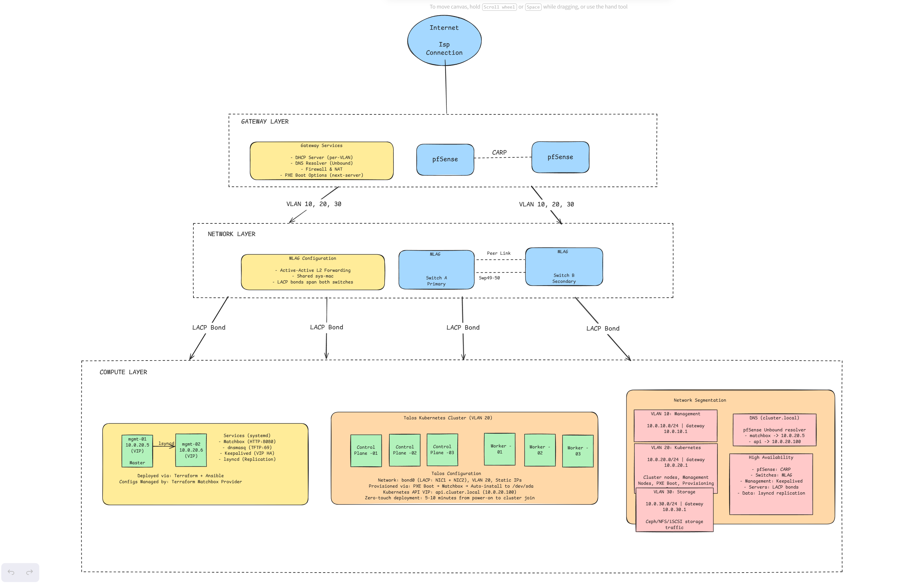
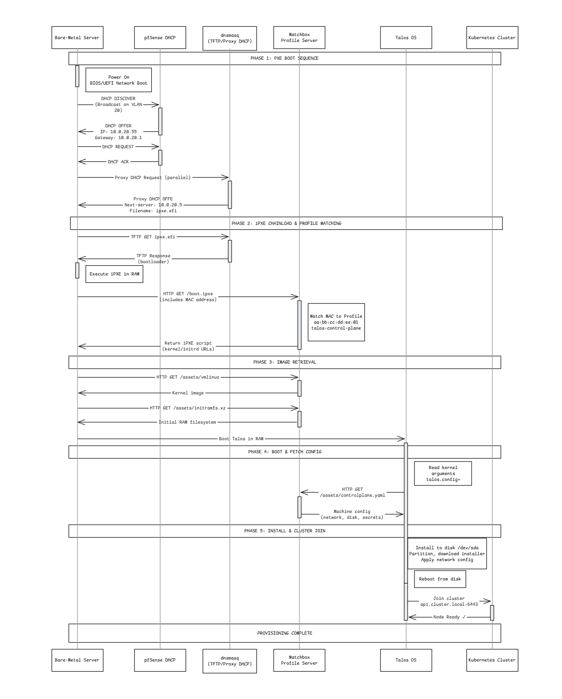

# PXE Network Boot with Talos Linux & Dynamic DNS

## Architecture


## PXE Boot Sequence



## Detailed Service Stack


### 1. pfSense Firewall/Gateway (HA Pair)

This component provides the core edge security, routing, and network services for the infrastructure. It is implemented as a High Availability (HA) cluster of two bare-metal appliances running pfSense, ensuring no single point of failure at the network perimeter.

One appliance operates as the Primary node, actively handling all traffic and services, while the other serves as a hot-standby secondary node.

#### High Availability Mechanism: CARP

To achieve stateful, seamless failover, the cluster relies on the Common address Redundancy Protocol (CARP). CARP allows both pfSense appliances to share a set of virtual IP (VIP) addresses.

All client devices on the network (servers, workstations) are configured to use the CARP VIPs as their default gateway and DNS resolver.

- The Primary node owns these VIPS and responds to all traffic directed to them.
- The Secondary node continuously monitors the Primary's health. If the Primary fails, the Secondary node automatically and immediately takes ownership of all CARP VIPs, ensuring a seamless transition with minimal packet loss.

A dedicated SYNC interface is used to synchronize firewall states, NAT tables, and other critical data, allowing the Secondary to take over the stateful connections without interruption.

#### Configuration & Service Overview

The HA cluster is configured with distinct physical IPs for each node and shared CARP VIPs for all services.

| Interface | Purpose | Primary Node IP | Secondary Node IP | CARP Virtual IP (VIP) | Notes |
| :--- | :--- | :--- | :--- | :--- | :--- |
| **WAN** | Internet Edge | `203.0.113.2/24` | `203.0.113.3/24` | `203.0.113.1/24` | All inbound/outbound traffic uses the VIP. |
| **VLAN 10** | Management | (Varies) | (Varies) | `10.0.10.1/24` | Gateway for management network. |
| **VLAN 20** | Kubernetes | (Varies) | (Varies) | `10.0.20.1/24` | Gateway for Kubernetes nodes. |
| **VLAN 30** | Storage | (Varies) | (Varies) | `10.0.30.1/24` | Gateway for storage network. |
| **SYNC** | HA State Sync | `172.16.1.2/24` | `172.16.1.3/24` | (None) | Dedicated, non-routed link for `pfsync`. |

#### DHCP Server (per-VLAN)

The pfSense cluster provides DHCP services to internal networks. The configuration for the Kubernetes VLAN (VLAN 20) is specifically tailored for automated server provisioning.

- Enabled On: VLAN 20 (Kubernetes).
- Range `10.0.20.50` - `10.0.20.200`
- Gateway: `10.0.20.1` (The CARP VIP, ensuring clients always have a valid gateway).
- DNS Server: `10.0.20.1` (The CARP VIP, directing queries to the active firewall).
- Domain: `cluster.local`
- Network Booting (PXE):
	- Next-server: 10.0.20.5 (Points clients to the Matchbox server for provisioning).
	- Default BIOS filename: `undionly.kpxe`
	- UEFI 64-bit filename: `ipxe.efi`

#### DNS Resolver (Unbound)
The unbound DNS resolver is enabled to provide fast, local DNS services for the internal networks.

- Service: Enabled and listens on all internal interfaces.
- DHCP Integration: Automatically registers DHCP leases and static mappings in the DNS resolver. This allows all devices to be resolved by their hostname withing the `cluster.local` domain (e.g, `kube-node-01.cluster.local`).

#### HA & Synchronization Settings
- CARP Settings:

	- VHID (Virtual Host ID): A unique ID is assigned for each interface's CARP group (e.g. VHID 1 for WAN, 2 for VLAN 10, etc.).
	- Password: A strong, shared password secured the CARP advertisements for each group.
	- Skew: This controls priority. The Primary node uses a skew of 0 (highest priority), and the Secondary uses 100 (lower priority).
- Configuration Sync (XMLRPC):

	- The primary node is configured to automatically synchronize its configuration to Secondary's SYNC interfaces IP (172.16.1.3).
	- All critical configurations are synchronized, including firewall rules, NAT, virtual IPs, DHCP settings, and DNS settings, ensuring the Secondary is always ready to take over.

Resources: [High Availability | pfSense Documentation](https://docs.netgate.com/pfsense/en/latest/highavailability/index.html)


## 2. MLAG Switch Pair

This component consists of high-availability pair of Layer 2 switches, deployed in a Top of Rack (ToR) position within the datacenter or server room. The pair includes two identical units (Switch A and Switch B) running a network operating system that supports Multi-Chassis Link Aggregation (MLAG), such as Cumulus Linux or NVIDIA ONYX.

The primary objective of this design is to provide active-active, fault-tolerant connectivity for downstream servers. By configuring the switches for MLAG, the pair presents itself as a single, logical switch to any connected device, allowing servers to form standard LACP (802.3ad) bonds with physical links terminating on two different chassis.

#### Design & Configuration Overview

The MLAG functionality is established through a few critical configuration elements:

1. Peer Link (IPL): A high-bandwidth link aggregation group (e.g `peerlink` using `swp49` and `swp50`) is created between the two switches. This link is essential for synchronizing the control plane, exchanging heartbeats, and forwarding data traffic in the event of an uplink failuer.
2. MLAG Control Plane: A dedicated VLAN interface (e.g `peerlink.4094`) runs on the Peer Link to manage the MLAG state via the `clagd` daemon. Each switch uses a backup IP for peer discovery (`10.255.255.2` for A, `10.255.255.1` for B), and a `clagd-priority` value determines the primary switch (lower is better).
3. Virtual System MAC: This is the key to the entire configuration. Both switches must be configured with the exact same `clagd-sys-mac`. This shared virtual MAC is what the MLAG-pair uses to communicate with downstream servers, tricking them into seeing a single LACP partner.
4. MLAG Server Bonds: Server facing ports (e.g. `swp1`) are configured as part of a bond (`bond1`). The `clag-id` 1 attribute tells the switch that this bond is part of an MLAG group. The partner switch must have an identical bond configuration with the same `clag-id` for the server's LACP group to form correctly across both chassis.
5. VLAN Bridging: All necessary VLANs (10, 20, 30) are added to a `bridge-vlan-aware` interface, which includes the Peer Link and all server-facing MLAG bonds. This ensures consistent Layer 2 domain propagation across both switches.

This active-active configuration provides seamless failover if one switch or link fails and allows for full bandwidth utilization of all server connections.

#### Switch A Configuration

```
# /etc/network/interfaces

# Peer Link (MLAG IPL)
auto peerlink
iface peerlink
  bond-slaves swp49 swp50
  bond-mode 802.3ad

auto peerlink.4094
iface peerlink.4094
  clagd-peer-ip linklocal
  clagd-backup-ip 10.255.255.2
  clagd-sys-mac 44:38:39:BE:EF:AA
  clagd-priority 1000

# VLANs
auto bridge
iface bridge
  bridge-ports peerlink bond1 bond2 bond3
  bridge-vlan-aware yes
  bridge-vids 10 20 30
  bridge-pvid 1

# Server-facing bonds (MLAG-enabled)
auto bond1
iface bond1
  bond-slaves swp1
  clag-id 1
  bridge-access 20
```

#### Switch B Configuration

```
# /etc/network/interfaces

# Peer Link (MLAG IPL)
auto peerlink
iface peerlink
  bond-slaves swp49 swp50
  bond-mode 802.3ad

auto peerlink.4094
iface peerlink.4094
  clagd-peer-ip linklocal
  clagd-backup-ip 10.255.255.1
  clagd-sys-mac 44:38:39:BE:EF:AA
  clagd-priority 2000

# VLANs
auto bridge
iface bridge
  bridge-ports peerlink bond1 bond2 bond3
  bridge-vlan-aware yes
  bridge-vids 10 20 30
  bridge-pvid 1

# Server-facing bonds (MLAG-enabled)
auto bond1
iface bond1
  bond-slaves swp1
  clag-id 1
  bridge-access 20
```

**Resources:**

- [Multi-Chassis Link Aggregation - MLAG | Cumulus Linux 5.14](https://docs.nvidia.com/networking-ethernet-software/cumulus-linux-514/Layer-2/Multi-Chassis-Link-Aggregation-MLAG/)
- [Interface Configuration and Management | Cumulus Linux 5.14](https://docs.nvidia.com/networking-ethernet-software/cumulus-linux-514/Layer-1-and-Switch-Ports/Interface-Configuration-and-Management/)

### 3. Management Node
The Management Nodes serve as the central provisioning infrastructure for the entire bare-metal fleet. These nodes host the PXE boot services (Matchbox and dnsmasq) that automate the deployment of Talos Linux on all compute servers and it acts as the primary administrative workstation for managing the Kubernetes cluster.

#### Deployment
This architecture details a highly available (HA) provisioning system, primarily designed for deploying Talos Kubernetes clusters. The setup uses a pair of management nodes configured for automatic service failover and data replication.

- **Infrastructure Provisioning:** **Terraform** is responsible for building the foundational infrastructure. It provisions two management nodes (either as virtual machines or on bare metal) running **Ubuntu 24.04 LTS**. These nodes are configured with static IPs on VLAN 20. Upon completion, Terraform outputs an inventory file for use by Ansible.

- **System Configuration:** **Ansible** handles the complete system setup. It installs **Matchbox** (for iPXE booting) and **dnsmasq** (for DHCP/PXE) as systemd services. It also installs the Talos CLI and other administrative utilities. For high availability, Ansible configures **Keepalived** to manage a floating IP and **lsyncd** to handle real-time data replication.

#### Network Configuration
All components operate on **VLAN 20**, which is designated for Kubernetes traffic. The system uses a floating Virtual IP (VIP) as the stable endpoint for all services. The network's gateway and DNS resolution are both provided by a pfSense CARP VIP at `10.0.20.1`.
The management node and VIP configuration is as follows:
- **VLAN:** 20 (Kubernetes)
- **Gateway:** `10.0.20.1` (pfSense CARP VIP)
- **DNS:** `10.0.20.1` (pfSense Unbound resolver)
- **OS:** Ubuntu 24.04 LTS

| Node    | IP Address         | Keepalived Priority | Role            |
| ------- | ------------------ | ------------------- | --------------- |
| mgmt-01 | `10.0.20.5/24`     | 100                 | MASTER          |
| mgmt-02 | `10.0.20.6/24`     | 90                  | BACKUP          |
| **VIP** | **`10.0.20.5/24`** | **-**               | **Floating IP** |
#### High Availability Strategy

Resilience is achieved through two complementary mechanisms: automatic service failover and real-time data synchronization.

**1. Keepalived VIP Management** A floating **VIP (`10.0.20.5`)** serves as the single entry point for all provisioning requests. This VIP is managed by **Keepalived**:

- The IP is active on `mgmt-01` (MASTER) during normal operation.
- Keepalived runs continuous health checks against the local Matchbox and dnsmasq services.
- If `mgmt-01` fails or its key services stop responding, Keepalived automatically fails over, re-assigning the VIP to the `mgmt-02` (BACKUP) node. This failover process typically completes in under three seconds.


**2. Data Replication (lsyncd)** To ensure the BACKUP node is always ready to take over, **lsyncd** provides real-time replication of critical assets:

- It uses `inotify` on the MASTER node to instantly detect changes within the `/var/lib/matchbox/assets/` directory.
- Any new or modified assets (such as `vmlinuz` kernels, `initramfs` images, or YAML configs) are immediately and securely copied to the BACKUP node over SSH.
- This replication is intentionally limited to static assets. Dynamic configurations, such as Matchbox profiles and groups, are managed via the Matchbox API and do not require filesystem synchronization.

### 4. Matchbox (Profile Server)

Matchbox is the core component of the automated provisioning pipeline. It is a lightweight HTTP server designed to match bare-metal machines to specific boot profiles based on their hardware attributes like their MAC address.

When a new server PXE boots, it is directed by the DHCP server hosted on pfSense to fetch its iPXE boot script from the Matchbox. Matchbox then identifies the machine and serves a specific profile that tells the machine exactly which kernel, initramfs, and kernel arguments to use for booting, enabling fully automated, zero touch provisioning of the Talos operating systems.

#### Deployment

Matchbox runs as a **native systemd service** on both Management Nodes.

Systemd Unit:
```ini
# /etc/systemd/system/matchbox.service
[Unit]
Description=Matchbox Boot Profile Server
Documentation=https://github.com/poseidon/matchbox
After=network-online.target
Wants=network-online.target

[Service]
Type=simple
User=matchbox
Group=matchbox
ExecStart=/usr/local/bin/matchbox \
  -address=0.0.0.0:8080 \
  -data-path=/var/lib/matchbox \
  -log-level=info
Restart=on-failure
RestartSec=5s

[Install]
WantedBy=multi-user.target
```

#### Configuration & Directory Structure
All matchbox data is stored on the host at `/opt/provisioning/matchbox/data/`. This directory is organized into three key areas that work together to provision a machine:

```
/var/lib/matchbox/
├── assets/
│   ├── vmlinuz              # Talos Linux kernel image
│   ├── initramfs.xz         # Talos Linux initial RAM filesystem
│   ├── controlplane.yaml    # Talos configuration for control plane nodes
│   └── worker.yaml          # Talos configuration for worker nodes
├── profiles/
│   ├── control-plane.json   # Profile for control plane nodes
│   └── worker.json          # Profile for worker nodes
└── groups/
    ├── cp-01.json           # Maps MAC address to control-plane profile
    ├── cp-02.json
    ├── cp-03.json
    ├── worker-01.json       # Maps MAC address to worker profile
    └── worker-02.json
```

1. `assets/` This directory holds the static files that will be served over HTTP to the booting clients. For this table deployment, it contains the Talos kernel (`vmlinuz`), the initial RAM disk (`initramfs.xz`), and the crucial machine configuration files.
2. `profiles/` A profile is a JSON file that defines what a machine should boot. It specifies the kernel, initramfs, and kernel arguments. The most critical kernel argument is `talos.config`, which points the booting Talos instance to its machine configuration file, and also served from the assets directory.

Profile Example

```json
// profiles/control-plane.json
{
  "id": "talos-control-plane",
  "name": "Talos Linux - Control Plane",
  "boot": {
    "kernel": "/assets/vmlinuz",
    "initrd": ["/assets/initramfs.xz"],
    "args": [
      "initrd=initramfs.xz",
      "init_on_alloc=1",
      "slab_nomerge",
      "pti=on",
      "console=tty0",
      "console=ttyS0",
      "printk.devkmsg=on",
      "talos.platform=metal",
      "talos.config=http://10.0.20.5:8080/assets/controlplane.yaml"
    ]
  }
}
```

3. `groups/` A Group is a JSON file that maps a specific machine to a profile. This is the matching part of Matchbox. Using a selector, Matchbox identifies the machine and assigns it the specific profile. This ensures each physical server gets its designed role automatically.

Group Example

```json
// groups/cp-01.json
{
  "id": "talos-cp-01",
  "name": "Control Plane Node 1",
  "profile": "talos-control-plane",
  "selector": {
    "mac": "aa:bb:cc:dd:ee:01"
  }
}
```

### Data Sync Strategy

A critical aspect of the high-availability design is _how_ this data is kept in sync:

- **`assets/` (Static Files):** Replicated via **lsyncd**. Because these are static files, lsyncd provides simple, real-time filesystem replication to the backup node.
- **`profiles/` & `groups/` (Configuration):** Managed via the **Terraform Matchbox Provider**. These configurations are treated as code and pushed to the Matchbox API. Terraform ensures that both nodes (master and backup) have the identical configuration, as it applies the state to the Matchbox service on _both_ management nodes.
#### Configuration Management

To maintain consistency and provide an audit trail, **Profiles** and **Groups** are not managed by editing JSON files by hand. Instead, they are defined as code using the **Terraform Matchbox Provider**.

This approach means all node definitions are stored in Git, changes are made via pull requests, and updates are applied atomically with `terraform apply`.

Terraform Example

```hcl
# Terraform configuration
# Terraform configuration

# 1. Defines the 'what': what kernel, initrd, and args to use.
resource "matchbox_profile" "talos_control_plane" {
  name   = "talos-control-plane"
  kernel = "/assets/vmlinuz"
  initrd = ["/assets/initramfs.xz"]
  
  args   = [
    "initrd=initramfs.xz",
    "init_on_alloc=1",
    "slab_nomerge",
    "pti=on",
    "console=tty0",
    "console=ttyS0",
    "printk.devkmsg=on",
    "talos.platform=metal",
    # This key argument tells Talos where to fetch its config
    "talos.config=http://10.0.20.5:8080/assets/controlplane.yaml"
  ]
}

# 2. Defines the 'who': maps a MAC address to the profile.
resource "matchbox_group" "cp_01" {
  name    = "talos-cp-01"
  profile = matchbox_profile.talos_control_plane.name
  
  selector = {
    mac = "aa:bb:cc:dd:ee:01"
  }
}
```

### 5. dnsmasq (TFTP & Proxy DHCP Server)
This component is the essential first step in the network boot process, working in tandem with both the main pfSense DHCP server and the Matchbox profile server. Its role is to provide the initial iPXE bootloaders via TFTP and to direct booting clients to the Matchbox server.

It runs as a systemd service on both Management Nodes and is configured in Proxy DHCP mode (does not assign IP addresses, only provides PXE boot options).

**Why Proxy DHCP:**
- Does not conflict with pfSense DHCP server
- Provides only PXE-specific options (next-server, boot filename)
- pfSense handles IP assignment, dnsmasq handles boot options

#### Systemd Service

```ini
# /etc/systemd/system/dnsmasq-pxe.service
[Unit]
Description=dnsmasq PXE/TFTP Server
After=network-online.target
Wants=network-online.target

[Service]
Type=forking
ExecStart=/usr/sbin/dnsmasq -C /etc/dnsmasq.d/pxe-boot.conf
ExecReload=/bin/kill -HUP $MAINPID
Restart=on-failure

[Install]
WantedBy=multi-user.target
```

#### TFTP Boot Files

The TFTP root directory (`/srv/tftp/`) contains the iPXE bootloaders:

- `undionly.kpxe` - For BIOS/Legacy boot
- `ipxe.efi` - For UEFI boot

These are downloaded from the official iPXE project and served to clients during initial PXE boot.

Resources: [iPXE chainloading to use dnsmasq and proxydhcp - DEV Community](https://dev.to/arachan/ipxe-chainloading-to-use-dnsmasq-and-proxydhcp-4he)

#### Core Software Components
The node is provisioned with a specific set of software to fulfill its role:
1. Container Runtime: Docker and Docker Compose are installed to run the core provisioning services like Matchbox in a containerized and isolated environment.
2. Cluster CLI: The Talos CLI is installed, allowing this node to function as the primary administrative workstation for communicating with and managing the Talos Kubernetes cluster's API.
3. Administrative Utilities: A standard suite of tools (`tcpdump`, `curl`, `jq`, `dnsutils`, `vim`) is installed for network diagnostics, API interaction, and system management.

```
#!/bin/bash
#
# This script bootstraps the Management Node with all
# necessary software components.

# Update package lists
sudo apt update

# Install Docker and Docker Compose
sudo apt install -y docker.io docker-compose

# Install essential administration and networking utilities
sudo apt install -y tcpdump curl jq dnsutils vim

# Install the Talos CLI for cluster administration
# This command downloads the installer and runs it.
curl -sL https://talos.dev/install | sh

echo "Management Node setup complete."
echo "Please move the talosctl binary to /usr/local/bin or similar."
# Example: sudo mv ./talosctl /usr/local/bin/
```

Resources: 
- [talosctl - Sidero Documentation](https://docs.siderolabs.com/talos/v1.10/getting-started/talosctl)

### 6. Talos Linux Servers (Kubernetes Nodes)
These are the bare metal servers that will form the kubernetes cluster. They are provisioned automatically using the PXE boot pipeline (pfSense DHCP -> dnsmasq -> Matchbox) and will run Talos Linus, an immutable, API driven operating system designed for Kubernetes.

- Location: Installed in server racks, with physical network connections to the MLAG ToR switch pair.
- Quantity: A production cluster requires a minimum of 3 control plane nodes and one or more worker nodes.

### Hardware & BIOS Configuration
To function as a reliable node, each server must meet the following specifications and BIOS settings.

|**Category**|**Requirement**|**Notes**|
|---|---|---|
|**CPU**|2 cores (Minimum)|4+ cores recommended for production.|
|**RAM**|4GB (Minimum)|8GB+ recommended.|
|**Disk**|50GB (Minimum)|100GB+ SSD/NVMe recommended for etcd and container images.|
|**NICs**|2x 1Gbps+|Required for the LACP bond for redundant, high-throughput networking.|
|**BIOS Mode**|UEFI (Preferred) or Legacy|Must match the PXE bootloader (`ipxe.efi` or `undionly.kpxe`).|
|**Boot Order**|1. Hard Disk 2. Network Boot (PXE)|**Critical:** This ensures that after Talos is installed to the disk, the server boots from it. If the disk is empty (first boot), it falls back to PXE to start the provisioning.|
|**Network**|PXE Stack Enabled|Must be enabled on the NICs included in the bond.|

#### Network Configuration (Post-Install)
This configuration is defined in the `controlplane.yaml` and `worker.yaml` files served by Matchbox and applied by the Talos installer. The key feature is the `bond0` interface, which creates an `802.3ad` (LACP) bond across two physical NICs.

```yaml
# This snippet is part of the controlplane.yaml/worker.yaml
# file delivered by Matchbox
machine:
  network:
    hostname: talos-cp-01  # Hostname is set by the Talos config
    interfaces:
      - interface: bond0
        bond:
          mode: 802.3ad  # Use LACP to match the MLAG switches
          lacpRate: fast
          deviceSelectors:
            - busPath: "0*:*:00.0"  # First NIC
            - busPath: "0*:*:00.1"  # Second NIC
        vlans:
          - vlanId: 20  # The node's primary interface is on VLAN 20
            dhcp: false  # Static IP is used
            addresses:
              - 10.0.20.10/24  # Static IP assigned via Talos config
            routes:
              - network: 0.0.0.0/0
                gateway: 10.0.20.1  # The pfSense CARP VIP
        mtu: 1500

  install:
    disk: /dev/sda  # Talos will be installed to the first available disk
    image: ghcr.io/siderolabs/installer:v1.10.6
    wipe: true  # Destructive install, wiping the disk

```
Resources:

- [Network Configuration - Sidero Documentation](https://docs.siderolabs.com/talos/v1.11/platform-specific-installations/bare-metal-platforms/network-config)

- [Matchbox - Sidero Documentation](https://docs.siderolabs.com/talos/v1.11/platform-specific-installations/bare-metal-platforms/matchbox)
- [PXE - Sidero Documentation](https://docs.siderolabs.com/talos/v1.11/platform-specific-installations/bare-metal-platforms/pxe)

### 7. Talos Configuration Files
These are the most critical files in the provisioning process. They are YAML documents that contain the complete declarative configuration for every Talos node, including networking, disk installation, cluster secrets, and node roles.

These files are generated on a Management Node and placed in `/var/lib/matchbox/assets/` where they are served over HTTP by Matchbox and replicated to the backup node via lsyncd.

#### Initial Generation

```bash
# Run this from a Management Node
cd /var/lib/matchbox/assets

# Generate the core config files
# The endpoint (10.0.20.100) is the Virtual IP for the Kubernetes API
talosctl gen config mycluster https://10.0.20.100:6443 \
  --with-secrets secrets.yaml \
  --output-dir .

# This command creates:
# - controlplane.yaml (Template for control plane nodes)
# - worker.yaml (Template for worker nodes)
# - talosconfig (Admin kubeconfig file for this cluster)
# - secrets.yaml (All cluster secrets - MUST BE SECURED)
```

#### Required Customization

The default generated files must be customized to include infrastructure-specific configurations for network bonding and disk installation. The network bond configuration shown in section 6 must be added to both `controlplane.yaml` and `worker.yaml`.

## Supporting Infrastructure

### 8. Internet Gateway (ISP Connection)

This is the upstream connection provided by the Internet Service Provider (ISP). It terminates at the WAN interface of the pfSense firewall cluster and is configured as required by the ISP (e.g., Static IP, PPPoE, or DHCP). All outbound traffic from the cluster and management networks egresses through this gateway.

### 9. Out-of-Band Management (OOB)

This component consists of the dedicated management interfaces on the servers (e.g., IPMI, iDRAC, iLO). These provide lights-out access for remote power control, hardware health monitoring, and virtual console access, completely independent of the main operating system.

For security, this traffic is segregated onto its own network.
- **Network:** VLAN 10 (Management)
- **IP Range:** `10.0.10.100` - `10.0.10.199` (Static IPs)
- **Gateway:** `10.0.10.1` (pfSense CARP VIP for VLAN 10)

### 10. VLAN Summary
This table summarizes the Layer 2/3 network segmentation for the entire infrastructure. All routing and firewalling between VLANs are handled by the central pfSense HA cluster.

|**VLAN ID**|**Name**|**Subnet / Gateway (CARP VIP)**|**Purpose & Key Services**|
|---|---|---|---|
|**10**|Management|`10.0.10.0/24` Gateway: `10.0.10.1`|**OOB Management:** Secured network for IPMI/iDRAC/iLO interfaces. Provides remote power and console access.|
|**20**|Kubernetes|`10.0.20.0/24` Gateway: `10.0.20.1`|**Main Cluster Network:** - PXE Booting (DHCP, Proxy, TFTP) - Management Node (`10.0.20.5`) - Kubernetes Control Plane (`10.0.20.10+`) - Kubernetes Workers|
|**30**|Storage|`10.0.30.0/24` Gateway: `10.0.30.1`|**Storage Fabric:** Dedicated network for high-throughput storage traffic (e.g., Ceph, NFS, iSCSI) to avoid congestion on the main cluster network.|

### 10. DNS Resolution (`cluster.local`)
Internal DNS for the `cluster.local` domain is provided by the unbound DNS Resolver service on the pfSense HA cluster. This allows all nodes and services to resolve each other by name.

- Static Records: 
- Manually created entries for critical infrastructure.
	- `matchbox.cluster.local` -> `10.0.20.5`: Used by iPXE scripts and Talos configs to find the provisioning servers.
	- `api.ckuster.local` -> `10.0.20.100`: A virtual IP for the Kubernetes API, typically managed by Talos itself, providing a stable endpoint for kubectl.
- Dynamic Records: 
	- Automatically created by the DHCP registration feature in pfSense.
	- When a server gets its initial DHCP lease, its hostname is automatically registered in DNS, making it immediately resolvable.

## Deployment Automation

The entire provisioning pipeline is automated through a three-stage process. This separation of concerns ensures a reliable, repeatable, and version-controlled system.

1. **Terraform** provisions the base infrastructure (VMs, network).
2. **Ansible** configures the operating systems and installs all required services.
3. **Terraform** (with the Matchbox provider) configures the application-level logic (boot profiles and node assignments).
### Stage 1: Infrastructure Provisioning (Terraform)

The process begins with Terraform, which is responsible for building the foundational infrastructure for the two management nodes.

**High-Level Workflow** A single `terraform apply` provisions the nodes and generates the necessary inventory for the next stage.
```
cd terraform/
terraform init
terraform apply
```

During this stage, Terraform performs several key actions:

- Provisions the two Management Node VMs (or configures bare-metal hosts via IPMI/Redfish).
- Configures their network interfaces with static IPs on VLAN 20.
- Creates and attaches any required storage volumes.
- Dynamically generates an Ansible inventory file, which seamlessly passes control to the configuration stage.

### Stage 2: System Configuration (Ansible)

With the infrastructure in place, Ansible takes over to handle the complete system configuration. It applies a series of roles to both management nodes, ensuring they are identically configured for high availability.

**High-Level Workflow** The master playbook is run against the inventory file created by Terraform.

```
cd ansible/
ansible-playbook -i inventory.yml site.yml
```

This command orchestrates a series of specialized roles to build the complete service:

- **`common`**: Applies base OS setup, installs common packages, and performs security hardening.
- **`matchbox`**: Downloads the Matchbox binary, creates the systemd unit file, and starts the service.
- **`dnsmasq`**: Installs and configures dnsmasq for PXE booting, including placing the required TFTP bootloaders.
- **`keepalived`**: Configures the floating VIP (`10.0.20.5`) and sets up health checks for the Matchbox and dnsmasq services.
- **`lsyncd`**: Configures real-time file replication to the peer node for the `/var/lib/matchbox/assets` directory.
- **`talos-cli`**: Installs the `talosctl` CLI and other administrative utilities.

### Stage 3: Matchbox Configuration (Terraform)

In the final stage, control is passed back to a separate Terraform project. This project uses the **Terraform Matchbox Provider** to manage the application's configuration (the boot profiles and groups) by communicating directly with the Matchbox API.

**High-Level Workflow** This workflow allows all node definitions to be stored as code in Git. Applying the configuration connects to the Matchbox service (running on the VIP) and pushes the desired state.
```
cd matchbox-configs/
terraform init
terraform apply
```

**Practical Example: Adding a New Node** This Configuration as Code approach makes adding new hardware a simple, auditable process.

1. **Edit Configuration:** A new node is added to a `.tf` file (e.g., `matchbox-configs/groups.tf`) by mapping its MAC address to a profile.

```
    locals {
      worker_nodes = {
        "worker-01" = "aa:bb:cc:dd:ee:11"
        "worker-02" = "aa:bb:cc:dd:ee:12"
        "worker-03" = "aa:bb:cc:dd:ee:13"  # <-- New node added
      }
    }
```

2. **Apply Changes:** The `terraform apply` command is run, and Terraform intelligently creates only the new group via the Matchbox API.
```
terraform plan   # Preview changes
terraform apply  # Create the new group   
```

3. **Power On:** The new physical server is powered on. It automatically PXE boots, is identified by Matchbox, and provisions itself with the correct profile without any manual intervention.

### Service Dependencies & Boot Flow

This section details the precise, step by step sequence of events that occurs when a new bare-metal server is powered on for the first time.

1. Power On & PXE Boot: The server powers on. Finding no local OS, it falls back to its boot order and initiates a Network Boot (PXE) on its NICs.
2. pfSense (DHCP): The server sends a DHCP discover broadcast on VLAN 20. The pfSense gateway's DHCP server responds, assigning the node a temporary IP address e.g `10.0.20.55` and providing basic network options like gateway, DNS.
3. dnsmasq (Proxy DHCP): The dnsmasq container on the management node also sees the DHCP request. It replies with a Proxy DHCP offer, which only contains the TFTP boot options. Based on the client's type (BIOS or UEFI), it tells the client to download either `undionly.kpxe` or `ipxe.efi`.
4. dnsmasq (TFTP): The server requests the specified bootloader file e.g. `ipxe.efi` from the `dnsmasq` container via TFTP (port 69).
5. iPXE Chainload: The `ipxe.efi` bootloader executes. Its embedded script identifies the client as an iPXE client and, per the `dnsmasq` config, it chainloads to the Matchbox server by requesting `http://10.0.20.5:8080/boot.ipxe`.
6. Matchbox (HTTP Match): Matchbox receives the request, inspects the server's MAC address, and finds a matching Group file e.g. `groups/cp-01.json`.
7. Matchbox (HTTP Serve): The Group file points to a Profile e.g. `profiles/control-plane.json`). Matchbox serves the kernel (`vmlinuz`) and initramfs (`initramfs.xz`) specified in this profile, along with the kernel arguments.
8. Talos Boot: The server boots this in-memory Talos kernel. One of the kernel arguments, `talos.config=.../controlplane.yaml`, directs the node to fetch its complete configuration file from Matchbox over HTTP.
9. Talos Install: The booted Talos node reads its configuration, partitions and formats the specified install disk (`/dev/sda`), and installs Talos Linux from the specified installer image. It applies the full network config, including the static IP (e.g., `10.0.20.10`).
10. Reboot & Join: The node reboots. The BIOS boot order now finds the installed OS on the hard disk and boots from it. The node comes online with its static IP, connects to the Kubernetes API endpoint, and joins the cluster.

## EXTERNAL REQUIREMENTS

This design relies on the following external components being configured correctly.

### 1. Network Switches (MLAG Pair)

- **VLANs**: All VLANs (`10`, `20`, `30`) must be tagged (`802.1Q`) on all inter-switch links and all switch ports connected to servers (pfSense, Management Nodes, Talos nodes).
- **LACP**: All server-facing ports must be configured as Link Aggregation Control Protocol (`802.3ad`) bonds.
- **MLAG**: The LACP bonds must be part of a Multi-Chassis Link Aggregation (MLAG / `clag-id`) group to allow a server's bond to span both physical switches.
- **DHCP Relay**: **Not required.** The DHCP/PXE services (dnsmasq, pfSense) are on the same L2 broadcast domain (VLAN 20) as the clients, so no L3 relay is needed.

### 2. pfSense Firewall

**Firewall Rules (VLAN 20):**

- DHCP: Must allow `UDP 67, 68` for the pfSense DHCP service
- Proxy DHCP: Must allow `UDP 67, 4011` to `10.0.20.5` for the dnsmasq proxy
- TFTP: Must allow `UDP 69` to `10.0.20.5` for the dnsmasq TFTP service
- HTTP: Must allow `TCP 8080` to `10.0.20.5` for the Matchbox service
- DNS: Must allow `UDP 53` to `10.0.20.1` for the Unbound DNS resolver
- Talos API: Must allow `TCP 6443` to the Kubernetes API VIP (`10.0.20.100`)

### 3. Bare-Metal Host Hardware (Talos Servers)

- **Boot Mode**: BIOS/UEFI must be set to **Network Boot (PXE)** enabled
- **Boot Order**: This is **critical**. The boot order must be:
    
    1. **Hard Disk (e.g., `/dev/sda`)**
    2. Network Boot / PXE
    
    - **Rationale**: This ensures that on first boot (with an empty disk), the server boots from the network. After Talos installs itself to disk, every subsequent reboot will correctly boot from the hard disk.
- **Minimum Specs**:
    - CPU: 2 cores (4+ recommended)
    - RAM: 4GB (8GB+ recommended)
    - Disk: 50GB (100GB+ recommended)
    - NICs: 2x 1Gbps+ (for LACP bonding)

## Design Decisions & Trade-offs

### Deployment Approach: Docker Compose vs. Native Systemd + IaC

A primary decision was how to run the core provisioning services (Matchbox and dnsmasq). I evaluated a container-based approach (Docker Compose) against a native OS installation managed by Infrastructure as Code (IaC).

**Option 1: Docker Compose (Considered)**

This approach would involve running Matchbox and dnsmasq as Docker containers, managed by a `docker-compose.yml` file.

- **Pros:**
    
    - **Rapid Prototyping:** Excellent for temporary labs, demonstrations, or a proof-of-concept. A single `docker-compose up` can launch the entire stack.
    - **Encapsulation:** Dependencies are bundled within the images, making it portable across any machine with Docker.
    - **Easy Teardown:** `docker-compose down` cleanly removes all services, networks, and volumes.

- **Cons (for this Production Use Case):**
    
    - **Added Abstraction & Dependency:** It introduces the Docker daemon as another critical point of failure. If the daemon fails, the entire provisioning system fails.
    - **Complex Networking:** Exposing low-level network services like DHCP (from dnsmasq) and integrating them reliably with host-level networking and a VIP (Keepalived) is significantly more complex than a native installation.
    - **Opaque Health Checks:** While possible, it's less straightforward for Keepalived to perform deep health checks on a process running _inside_ a container versus a native systemd service.


**Option 2: Native Systemd + IaC (Terraform & Ansible) (Chosen)**

This approach uses **Terraform** to build the underlying VMs and **Ansible** to install the services (Matchbox, dnsmasq, Keepalived) directly on the host OS, where they are managed by `systemd`.

- **Pros:**
    
    - **Operational Simplicity:** No container abstraction. A service is a standard OS process, making it transparent to debug (`journalctl`), inspect, and manage (`systemctl`).
    - **Robust Integration:** Services like Keepalived integrate flawlessly with native `systemd` services for health checks and failover. This is a simple, battle-tested HA pattern.
    - **Minimal Dependencies:** This design avoids adding a container runtime, reducing the system's overall complexity and attack surface.
    - **Full Repeatability (IaC):** The combination of Terraform and Ansible makes the entire deployment idempotent, version-controlled, and fully repeatable. Disaster recovery is a matter of re-running the automation pipeline against new hardware.


**Decision:**
For a production environment, the **Native Systemd + IaC** approach was chosen. While Docker Compose is excellent for lab or development environments, this production deployment prioritizes operational maturity, simplicity, and robustness. The IaC approach provides superior repeatability and disaster recovery, while the native systemd integration is a simpler and more reliable foundation for critical, low-level network services.
## CHALLENGES & CONSIDERATIONS

### 1. Static MAC Matching

The Matchbox group files require static MAC-to-profile mappings. Every new host added to the fleet requires an administrator to obtain its MAC address and create a new group configuration via Terraform.

It doesn't scale well without an automation layer. Adding 50 nodes requires 50 Terraform resource definitions.

**Proposed Solution**:
- Use Terraform locals with maps to manage large fleets more efficiently.
- Maintain an accurate hardware inventory (MAC addresses, serial numbers, locations).

### 2. Insecure Provisioning (HTTP)
In this design, the Talos machine configuration files (`controlplane.yaml`, `worker.yaml`), which contain sensitive cluster secrets, are served over clear-text HTTP. This is a security risk.

Cluster secrets (certificates, tokens) are transmitted unencrypted during provisioning.

**Proposed Solution**:
- This risk is contained within the provisioning network (VLAN 20), which should be isolated
- For production-grade security, configure Matchbox to use HTTPS and have iPXE trust the certificate
- Alternative: Use Talos's built-in secrets encryption capabilities

### 3. LACP During PXE Boot

A host's PXE ROM (in its NIC firmware) and the iPXE bootloader do not typically speak LACP. They will boot using only one of the two bonded links.

The pre-boot process is not as resilient as the post-boot OS. If the single active NIC fails during PXE boot, the boot process will fail.

This is generally acceptable and a known limitation of PXE booting. Ensure physical link reliability.

### 4. Management Node Bootstrap

The Management Nodes themselves must be provisioned before they can provision other nodes. This creates a bootstrap requirement.

Management Nodes are provisioned via Terraform + Ansible automation, ensuring repeatability and disaster recovery capability.

Unlike the Talos nodes they provision, Management Nodes are not provisioned via PXE. They are either:

- Bare-metal hosts with OS pre-installed, then configured by Ansible.

### BONUS: ALTERNATE BOOT FLOWS

### Configurable Boot Targets

The Matchbox group files create a static mapping between a MAC address and a profile. To boot a host into an alternate flow (e.g., rescue mode, diagnostic mode), you change the mapping via Terraform.

**Example: Rescue Mode**

1. **Create a Rescue Profile** in Terraform:

```hcl
# matchbox-configs/profiles.tf
resource "matchbox_profile" "rescue" {
  name   = "ubuntu-rescue"
  kernel = "/assets/ubuntu-vmlinuz"
  initrd = ["/assets/ubuntu-initrd"]
  args   = [
    "boot=casper",
    "netboot=nfs",
    "url=http://releases.ubuntu.com/24.04/ubuntu-24.04-desktop-amd64.iso"
  ]
}
```

2. **Toggle the Host** to boot into rescue mode:

```hcl
# matchbox-configs/groups.tf
resource "matchbox_group" "cp_01" {
  name    = "talos-cp-01"
  profile = matchbox_profile.rescue.name  # ← Changed from talos_control_plane
  selector = {
    mac = "aa:bb:cc:dd:ee:01"
  }
}
```

3. **Apply the change**:

```bash
terraform apply  # Updates the group mapping via API
```

4. **Reboot the host**:

```bash
# Reboot via IPMI or physically
# On next PXE boot, Matchbox serves the rescue profile
```

5. **Return to normal operation**:

```hcl
# Change back to talos_control_plane profile
resource "matchbox_group" "cp_01" {
  name    = "talos-cp-01"
  profile = matchbox_profile.talos_control_plane.name  # ← Restored
  selector = {
    mac = "aa:bb:cc:dd:ee:01"
  }
}
```

```bash
terraform apply  # Restore normal boot profile
```